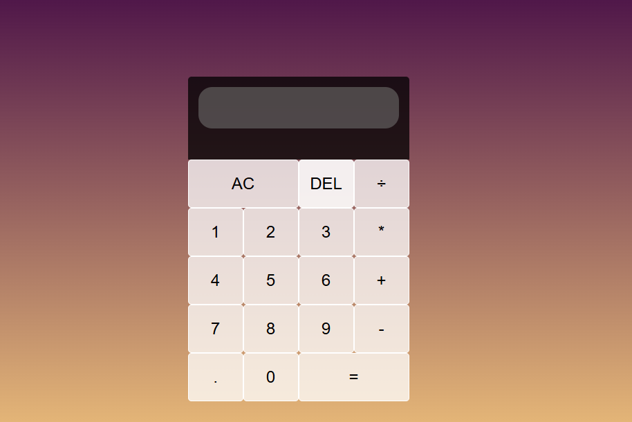

# Calculator Web Application

A sleek, responsive calculator built with HTML, CSS, and JavaScript that performs basic arithmetic operations.

  


## Live Demo
[Calculator](https://calculator-javascript-eight.vercel.app/)  


## Features
- Basic operations: addition, subtraction, multiplication, division
- Clear (AC) and delete (DEL) functionality
- Decimal point support
- Responsive grid layout
- Visual feedback for operations
- Clean, modern UI with gradient background

## Technologies Used
- HTML5
- CSS3 (Grid, Flexbox)
- JavaScript (ES6)
- Vercel (for deployment)

## Installation
To run locally:
1. Clone this repository
```bash
git clone [https://github.com/Kishoyan-Brian033/Calculator-Javascript]
